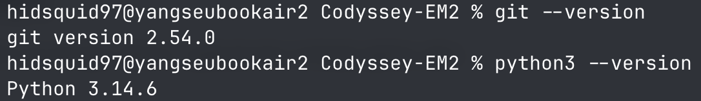
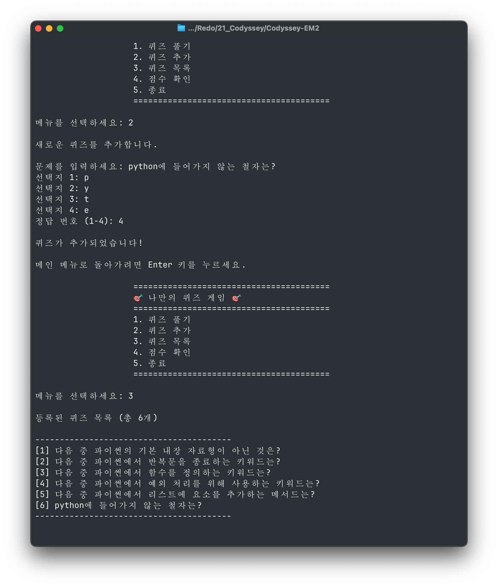
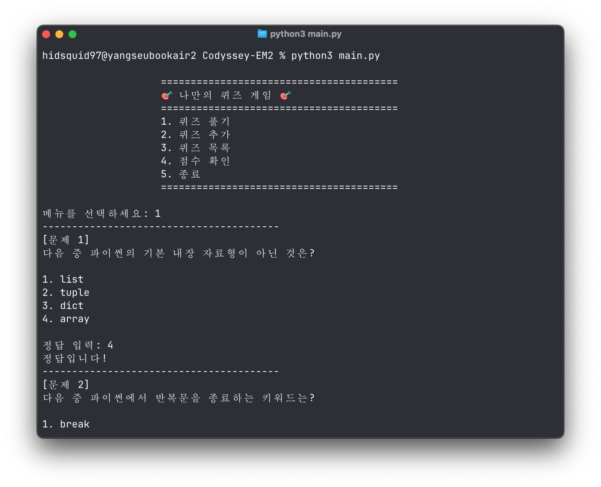
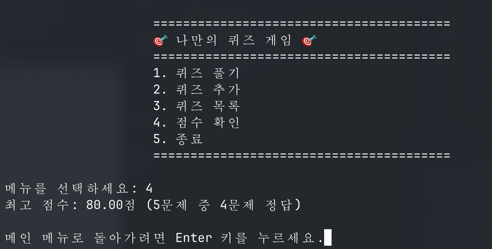
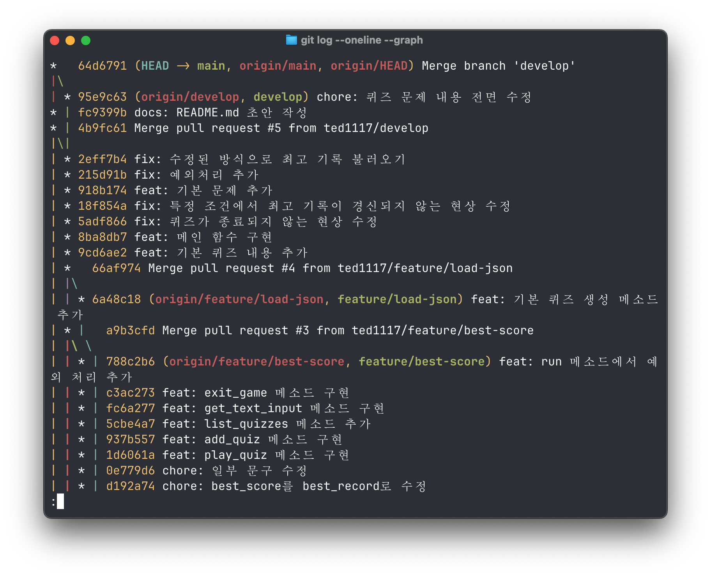
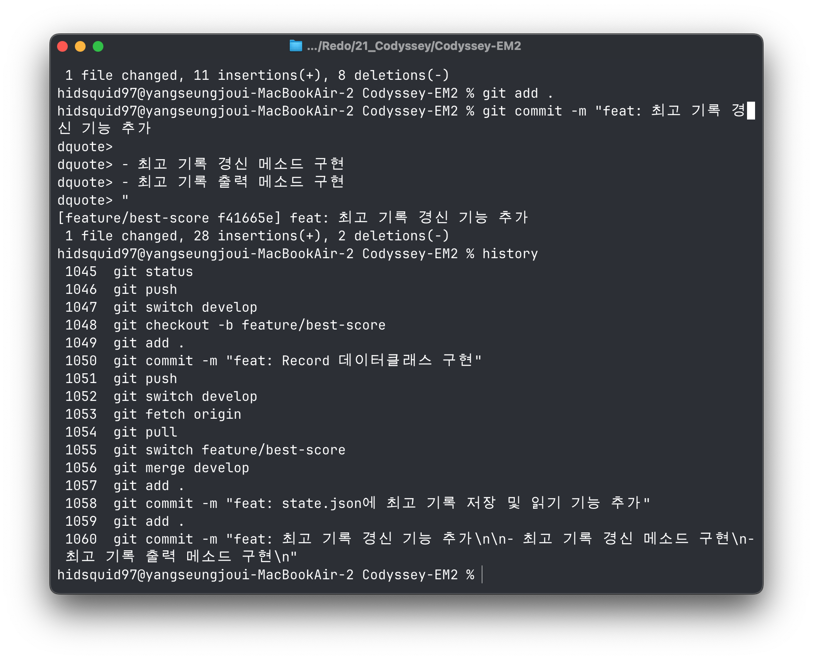
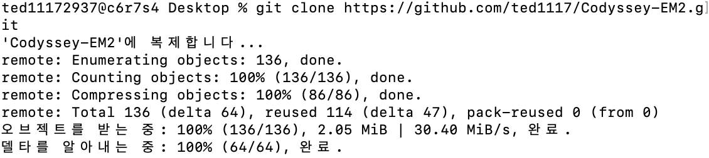
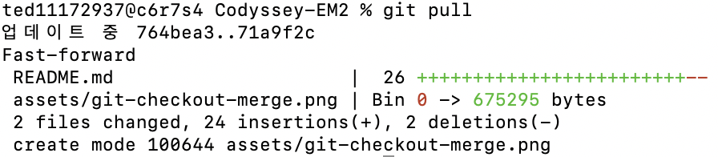

# 나만의 퀴즈 게임

## 프로젝트 개요

이 프로젝트는 Python의 기본 문법, 클래스와 객체, 예외 처리, 파일 입출력을
활용하여 만든 콘솔 퀴즈 게임입니다. 사용자는 메뉴에서 퀴즈 풀기, 퀴즈 추가,
퀴즈 목록 확인, 최고 점수 확인 기능을 선택할 수 있습니다.

게임의 실행 흐름, 퀴즈 데이터, 점수 기록, 파일 저장 기능을 각각 별도의
클래스와 모듈로 나누어 관리합니다.

## 퀴즈 주제 및 선정 이유

주제: Python 기초 지식
이유: 간단한 퀴즈로 Python 기초 지식을 학습합시다.

## 실행 환경



```zsh
git --version
python3 --version
```

- Python 3.10 이상
- 운영체제: Windows, macOS, Linux

## 실행 방법

저장소를 내려받은 뒤 프로젝트 루트에서 다음 명령을 실행합니다.

```zsh
python3 main.py
```

프로그램이 시작되면 원하는 메뉴 번호를 입력합니다.

```text
1. 퀴즈 풀기
2. 퀴즈 추가
3. 퀴즈 목록
4. 점수 확인
5. 종료
```

숫자가 아닌 값, 빈 값 또는 메뉴 범위를 벗어난 숫자를 입력하면 안내 메시지가
출력되고 다시 입력할 수 있습니다.

## 기능 목록

### 주요 기능

- 문제를 풀고 정답 여부와 최종 점수 확인
- 문제, 선택지 4개, 정답 번호를 입력하여 새로운 퀴즈 등록
- 등록된 퀴즈의 번호와 문제 목록 확인
- 지금까지 기록한 최고 점수와 정답 개수 확인

### 데이터 저장

- 퀴즈 추가 및 최고 기록 갱신 시 `state.json`에 즉시 저장
- 프로그램 종료 후 재실행해도 퀴즈와 최고 기록 유지

### 입력 및 예외 처리

- 빈 입력, 잘못된 숫자, 범위를 벗어난 입력 처리
- `Ctrl+C` 또는 입력 스트림 종료 시 가능한 상태를 저장하고 안전하게 종료
- 저장 파일이 없거나 손상된 경우 기본 퀴즈 데이터로 실행

## 실행 화면

### 퀴즈 추가 및 목록



### 퀴즈 플레이 및 결과



### 최고 점수 확인



## 파일 구조

```text
Codyssey-EM2/
├── main.py              # 프로그램 실행 진입점
├── quiz.py              # 개별 퀴즈를 표현하는 Quiz 클래스
├── quiz_game.py         # 메뉴와 게임 진행을 관리하는 QuizGame 클래스
├── record.py            # 점수 기록을 표현하는 Record 클래스
├── state_repository.py  # JSON 데이터 저장 및 불러오기
├── state.json           # 퀴즈 목록과 최고 기록을 저장하는 데이터 파일
├── requirements.txt     # 개발 도구 의존성 정보
├── assets/              # 과제 제출용 실행 화면
├── docs/
│   └── PRD.md           # 프로젝트 요구사항 문서
└── README.md            # 프로젝트 소개 및 실행 안내
```

## 데이터 파일 설명

- 저장 파일: 프로젝트 루트의 `state.json`
- 저장 내용: 퀴즈 목록과 최고 기록
- 파일 형식: JSON
- 파일 인코딩: UTF-8
- 한글 저장: 유니코드 이스케이프 없이 한글을 그대로 저장

`state.json`은 다음 구조를 사용합니다.

```json
{
  "quizzes": [
    {
      "question": "문제 내용",
      "choices": [
        "선택지 1",
        "선택지 2",
        "선택지 3",
        "선택지 4"
      ],
      "answer": 1
    }
  ],
  "best_record": {
    "total": 5,
    "correct": 4
  }
}
```

- `quizzes`: 저장된 퀴즈 목록
  - `question`: 문제 내용
  - `choices`: 네 개의 선택지
  - `answer`: 1부터 4까지의 정답 번호
- `best_record`: 최고 기록이며 아직 플레이하지 않았다면 `null`
  - `total`: 최고 기록을 세운 게임의 전체 문제 수
  - `correct`: 최고 기록을 세운 게임의 정답 수

- 파일 없음: 프로그램에 포함된 기본 퀴즈 사용
- 파일 읽기 실패: 오류 안내 후 기본 데이터로 복구
- JSON 손상: 오류 안내 후 기본 데이터로 복구

## Git

### 브랜치
```text
main
 └── develop
      ├── feature/quiz
      ├── feature/quizgame
      ├── feature/best-record
      └── feature/load-json
```

### Git 커밋 그래프



Git 커밋 그래프는 다음 명령의 실행 결과가 모두 보이도록 촬영합니다.

```zsh
git log --oneline --graph
```

### history







```zsh
# 새로운 브랜치 생성 후 이동
git checkout -b (새로운 브랜치)

# 파일 스테이징
git add (대상 파일)

# 커밋 메시지 작성 후 커밋
git commit -m "(커밋 메시지)"

# 원격 저장소 푸시
git push

# 머지
git merge (대상 브랜치)

# pull
git pull
```
